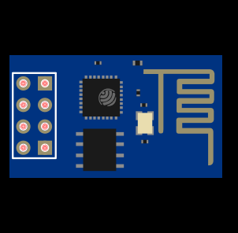

### Oi, sou o Mateus Eusébio, ou só Zébio 👋

Estudante de Engenharia de Computação pela Universidade Federal de Itajubá 

Aqui no Github compartilho projetos de Hardware e Software de sistemas embarcados. 
Usando Microcontroladores PIC, ESP32, ESP8266 e FPGAs

 
  
  
  
  

 
 

  <a href="https://github.com/Zebio">
  

